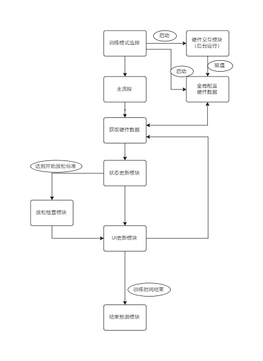

<!--
 * @Copyrights: 2021 @TheJunhan
 * @Date: 2021-08-25 15:30:21
 * @LastEditor: TheJunhan
 * @LastEditTime: 2021-08-25 17:24:05
-->

# 技术报告

## 开发环境

- Java作为开发语言，版本1.8
- 使用AndroidStudio作为IDE，版本4.2.2；
Sdk版本29，最低Sdk版本18
- 使用安卓真机进行调试。
- 使用Gradle进行项目构建
Gradle版本5.4.1
AndroidStudio的Gradle插件版本3.5.2

## 文件配置说明

- 在AndoridMenifest.xml文件中，除了传统蓝牙的BLUETOOTH权限之外，还添加了位置信息访问权限ACCESS_FINE_LOCATION  
- 在AndoridMenifest.xml文件中，为application配置属性`android:name=".constant.Global"`
- 在gradle文件中添加对`net.sf.json`的依赖，以导入json解析包。
  
## 项目架构

## 实现细节

1. **全局变量实现与使用**

    - Global类继承Android的Application组件并在xml中注册，在项目启动的时候实体化，使用的是单例模式，访问或者修改该变量可直接使用`Global.global.xx`。

2. **蓝牙模块**

    - 蓝牙模块的开发基于[BlunoBasicDemo](https://github.com/DFRobot/BlunoBasicDemo)。主要的更新修改发生在BluetoothLeService的第二个`broacastUpdate`函数中。在这里对蓝牙传输的信息进行解包并且调用`net.sf.json`包来解析Json字符串，获取到硬件传输过来的数据，然后会更新全局变量`Global.global.pressure`，以便其他的模块从中读取。数据的读和写是完全独立的，也没有更新频率的要求。

3. **列表实现**

    - 使用ListAdapter类继承BaseAdapter对ListView组件赋值，其对应的UI界面为list_item。
    - 如果需要修改列表样式需要修改`list_item`以及`ListAdapter`的`getView`的行为。
    - 如果需要修改点击列表的行为应在ListView组件赋值的类中进行，如在MainPage中对MyOnItemClickListener类的实现进行修改。

4. **设置界面与全局变量的绑定**

    - 设置界面侧边栏的效果是用DrawerLayout的布局实现的。设置了 `android:layout_gravity`属性的组件作为侧边栏出现
    - 通过`MainPage`的`setFoucuses`和`HWsetFoucus`函数对设置界面`EditText`的失焦事件进行绑定，并通过`SetValue`函数将设置的数据修改提交到全局变量中。
    - 在点击**恢复默认设置**的按钮之后，先显示`textTips`对话框来进行确认，之后再次调用`setdef()`函数把所有的设置参数都还原为MainPage中预设的默认数据大小。

5. **训练界面**

    训练的流程可对照上述架构图（接下来以止血为例）
    - 首先，在初始化的时候会根据我们选择的训练科目和四肢位置，即根据`currentType`来选择对应的压力范围以及流血速度等等。
    - 主流程是在HoeostasisDataPage中实现的，其中定时更新的操作是通过Timer和TimerTask实现的。每次更新都会从Global中读取到最新的压力数据；此外还可以动态地调整时间的流速speed以实现时间加速跳跃的效果。
    - 数据更新模块对应untils中的HoeoIncreaseModel类，处理噪声并计算失血量和有效时间；放松检查模块对应的是RelaxModel，最后UI更新对应setUI函数。
    - 界面左下角的心型图片是从很多对应不同血量的图片中选取的，其文件名对应其血量，我们每次更新通过当前失血量计算出文件名，改变ImageView的Src以实现图片切换。
    - 界面中间的图表对应DrawLineChart组件。图表中平行于x轴的红色的横线表示压力范围的上限，橙色横线表示压力范围的下限，可通过`setUpper()`和`setLower()`进行设置。坐标图上的点的数据存储在Values列表中，每次更新的时候都会把最新获取到的压力数据add到Values列表中，然后重绘图表以实现更新。此处还做了一个缓冲的操作，用一个小的storage来存储之前几次的数据，存满之后求平均值再写入Values，这样可以一定程度上处理噪声，也可以避免Values数组的容量膨胀。

6. **预测界面与计算模型**

    - 止血与绑绷带计算模型分别放在对应的结果类中，分别是TrainingPages.ResHomeostasis和ResBind。
    - 当训练结束之后，HoeostasisDataPage会通过`intent.putExtra()`把参数传递到结果页面进行计算。

7. **动画**
    - 训练界面，心脏跳动的动画。实现于heartBeat函数中。心脏的动画是大小缩放`ScaleAnimation`和透明度变化`AlphaAnimation`的组合，所以用一个AnimationSet来组织，并且设置repeatCount和repeatMode来实现循环播放的效果。setDuration调节播放一次动画的时间/速度，故还可以实现血量越低心跳越快的效果。
    - 结果预测界面，肢端坏死的动画。根据`currentType`训练类型的不同来修改对应的四肢的图片源，然后覆盖在原本的人体的图层上。一开始的各图片都是INVISIBLE的隐藏起来的，当判断结果是坏死之后再显示出来。动画的参数设置和心脏跳动类似，也是反复循环播放。

## 计算模型

### 止血带计算模型

计算公式如下：$score=D\times T\times L\times R\times 100$

- **参数D(delay):**
$D=1-\frac{delay}{delayMax} $
- **参数T(time):**
参数T是一个非0即1的系数，若效止血时间达到要求则T=1，若没有达到标准时长则T=0。
- **参数L(lose):**
$L=\begin{cases} 1,& \text{lose<=1000} \\ 1-\frac{lose - 1000}{1000},& \text{1000<lose<=2000}\\ 0,& \text{else}\end{cases}$
- **参数R(release):**
R有两个判别标准
一是在正常止血达到有效时间后，是否进行放松，若未进行放松则R = R * 0.6
二是判断压力过大时间是否超过预设值，如果超过了则R = R * 0.8

### 绷带计算模型

- 绷带共有三个分数段分别为20，80，100；分别代表延迟时间过长、平均压力过大和正常操作。

## 未来的工作

- 蓝牙模块的实现还需要补充的地方是，为了保证后台运行...修改unbind等等

## 参考文献  

1. 